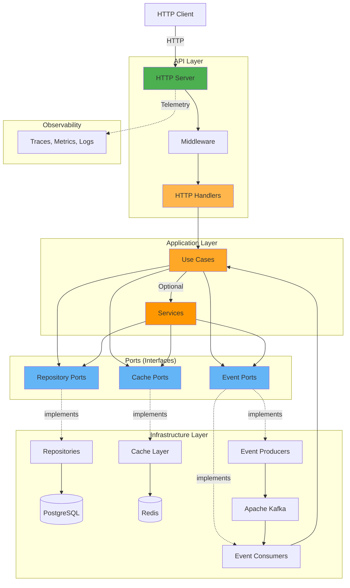

# Go Starter Kit

[](https://golang.org)
[](https://codecov.io/gh/cristiano-pacheco/go-starter-kit)
[](LICENSE)

A scalable Go API starter kit with clean architecture principles, authentication, event-driven patterns, and observability.

## Architecture



## Features

- 🔐 JWT Authentication & Authorization
- 📧 Email verification & templates
- 🔄 Event-driven with Apache Kafka
- 💾 Redis caching
- 📊 OpenTelemetry, Jaeger & Prometheus
- 📝 Swagger documentation
- 🐳 Docker Compose ready
- 🧪 Unit tests
- 🗄️ Database migrations
- 🎯 Dependency injection (Uber FX)
- 🌐 Fiber HTTP framework

## Quick Start

```bash
# Clone
git clone https://github.com/cristiano-pacheco/go-starter-kit.git
cd go-starter-kit

# Start infrastructure
docker-compose up -d

# Run migrations
make migrate

# Start server
make run
```

Server runs at `http://localhost:9000`  
Swagger docs at `http://localhost:9000/swagger/index.html`

## API Endpoints

### Authentication
- `POST /api/v1/auth/login` - Authenticate user and send verification code
- `POST /api/v1/auth/token` - Generate JWT token with verification code

### Users
- `POST /api/v1/users` - Create new user
- `PUT /api/v1/users` - Update user (requires authentication)
- `POST /api/v1/users/activate` - Activate user account

For detailed API documentation, see [Swagger UI](http://localhost:9000/swagger/index.html) when the server is running.

## Requirements

- Go 1.25.5+
- Docker & Docker Compose
- Make

## Configuration

Copy the `.env.example` file to `.env` and update the values as needed:

```bash
cp .env.example .env
```

## Project Structure

```
├── cmd/                    # CLI commands
├── internal/
│   ├── modules/           # Feature modules (identity, etc)
│   └── shared/            # Shared code
├── pkg/                   # Reusable packages
├── migrations/            # SQL migrations
└── docs/                  # Swagger docs
```

## Commands

```bash
# Development
make run                   # Run server
make migrate              # Run migrations

# Testing
make test                 # Run unit tests
make cover               # Coverage report

# Code quality
make lint                # Lint code
make static              # Run all checks
make update-swagger      # Update docs
```

## Tech Stack

**Core:** Go, Fiber, GORM, Viper, Cobra  
**Database:** PostgreSQL, Redis, golang-migrate  
**Messaging:** Apache Kafka  
**Observability:** OpenTelemetry, Jaeger, Prometheus, zerolog  
**Security:** JWT, bcrypt  
**Testing:** testify, mockery  
**DI:** Uber FX

## Docker Services

Docker Compose starts:
- PostgreSQL (5432)
- Redis (6379)
- Kafka (9092)
- Kafka UI (8080)
- Jaeger (16686)
- Prometheus (9090)

## License

MIT License - see [LICENSE](LICENSE)

## Author

**Cristiano Pacheco** - [@cristiano-pacheco](https://github.com/cristiano-pacheco)
